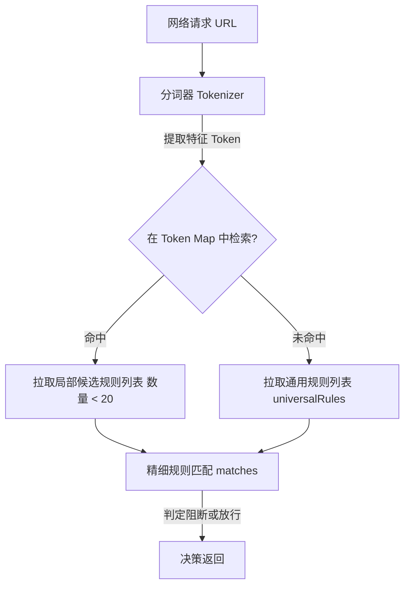

# Android WebView 广告拦截引擎性能优化调研报告

在启用“标准儿童过滤”或“强力去干扰”模式时，应用会引入 EasyList、EasyPrivacy 等规则，使得匹配规则库达到**十几万甚至数十万条**。在此背景下，网页加载与渲染出现严重卡顿。本报告针对该性能瓶颈进行深入调研，评估现有瓶颈、分析用户建议，并提供多套业界成熟、高可行性的最优优化方案。

---

## 1. 现有过滤引擎瓶颈分析

在当前的系统架构中，网页请求的拦截是在 `:webview` 进程的 `WebViewClient.shouldInterceptRequest` 回调中同步执行的。其核心匹配逻辑位于 `FilterEngine.decide`：

```kotlin
// FilterEngine.kt 中的 decide 方法
val importantBlock = importantBlockingRules.firstOrNull { it.matches(context) }
// ...
val exception = exceptionRules.firstOrNull { it.matches(context) }
// ...
val block = blockingRules.firstOrNull { it.matches(context) }
```

### 核心瓶颈点：
1. **线性扫描时间复杂度高 ($O(N)$)**：
   每一次图片、JS、CSS、XHR 等网络请求触发时，系统均会对 `importantBlockingRules`、`exceptionRules` 及 `blockingRules` 三个列表执行线性遍历（`firstOrNull`）。
   当规则总数达到 $20$ 万条时，对于网页中数十到上百个请求，每一个请求都可能需要比对十几万次。这直接导致网络拦截线程（通常是 WebView 的 IO 线程）被高频挂起，网页加载发生阻塞。
2. **复杂的字符串匹配与正则求值开销**：
   在 `CompiledRule.matches` 方法中，包含了大量的域名解析、URL 字符串提取、甚至昂贵的正则表达式（Regex）求值操作（`regex?.matcher(context.requestUrl)?.find()`）。这在 $O(N)$ 遍历的放大下，会瞬间吃满单核 CPU，造成严重的 CPU 瓶颈及手机发热。
3. **缓存击穿与动态参数干扰**：
   现有的 `decisionCache` 限制为最多 $512$ 条，且以完整请求 URL 作为缓存 Key。而现代网页的资源请求常带有动态参数（如 `?timestamp=...` 或随机 `token`），导致缓存命中率低。大量请求直接穿透缓存，落入低效的线性扫描路径。

---

## 2. 用户“命中规则缓存池”方案评估

### 方案设计：
维护一个高频命中规则的 LRU（最近最少使用）缓存池。用户访问网站时，优先匹配缓存池里的规则。若命中，则直接过滤或放行；未命中的请求再与规则大池子进行匹配。

### 优势分析：
- **热路径拦截极快**：对已经识别出是广告的请求（例如极常见的统计脚本、联盟广告域名等），可实现 $O(1)$ 或 $O(K)$（$K \ll N$）的极速拦截，减少了大池子匹配的频率。

### 局限与不足：
- **无法解决正常请求的“缓存穿透”**：
  在一个网页中，**正常且不应被拦截的资源请求占到 90% 以上**。这些正常请求由于不会命中任何拦截规则，无法在“命中拦截缓存池”中被匹配。这意味着这 90% 以上的正常请求**每一次依然必须完整遍历大池子**。因此，网页整体加载慢的问题无法得到根本性解决。
- **动态 URL 的规则泛化度低**：
  若广告 URL 包含动态 Query，精确的规则（例如 `||example.com/ad?*`）被提取到缓存池后，在匹配时由于缓存池里的规则依然要做通配符或正则求值，缓存池的扩展需要精细的索引支持，否则随着缓存池体积变大，其性能也会开始退化。

---

## 3. 业界最优优化方案推荐

借鉴主流广告拦截扩展（如 Brave 浏览器内核、uBlock Origin, AdGuard）的成熟实现，我们建议通过以下多维度的架构升级，实现即便开启数十万条规则也能流畅渲染网页。

### 方案一：基于 Token (关键字) 倒排索引的多级分治查找（核心推荐）
这是性能提升最显著的方案，能将匹配时间复杂度由 $O(N)$ 降低为 $O(1)$ 或 $O(\log N)$。

#### 具体实现：
1. **提取规则 Token**：
   在规则编译期，为每条网络过滤规则提取其特征关键字（Token），例如从 `||example.com/ads/banner.js` 中提取 `example.com`、`ads`、`banner`。
2. **建立倒排索引表（Token Map）**：
   维护一个 `HashMap<String, MutableList<CompiledRule>>`。将规则根据其 Token 存入对应的桶中。没有特征 Token 的通用规则放入 `universalRules` 列表中。
3. **快速筛选候选集**：
   当一个请求 URL 进来时（例如 `https://test.com/static/js/ad_banner.js`），将其解析并提取候选 Tokens（如 `test.com`、`static`、`ad_banner`）。
   仅去 `HashMap` 中查找包含这些 Token 的规则子集。单次请求需要匹配的候选规则数量将从 **20 万条瞬间压缩至十几条**，匹配效率可提升 **1000 倍** 以上。



### 方案二：利用布隆过滤器 (Bloom Filter) 实现 $O(1)$ 快速排除法（空间换时间）
由于 90% 网页请求为正常请求，我们可以使用 Bloom Filter 快速拦截这 90% 的“放行路”。

#### 具体实现：
1. **构建布隆过滤器**：
   在解析规则时，将所有规则中包含的阻断域名、特征路径等提取出来，写入一个驻留内存的布隆过滤器（Bloom Filter）。由于数十万条规则提取的主机名非常紧凑，Bloom Filter 的内存占用通常在几百 KB 到 1-2 MB 之间。
2. **快速排除（Fast Pass）**：
   对任何新请求，首先计算其 Host/URL 是否存在于布隆过滤器中。
   - **若返回不存在（False）**：布隆过滤器具备 100% 的准确率，说明该请求**绝对不匹配任何拦截规则**，直接判定为 `ALLOW` 并返回。这使得 90% 正常请求的处理时间几乎降为 $0$。
   - **若返回可能存在（True）**：仅在极少数存在冲突的情况下，才走深度的过滤引擎做精细检索。

### 方案三：域名树限制过滤 (Domain-Anchor Map)
很多过滤规则都有特定的域名适用范围（通过 `domains` 或 `excludedDomains` 选项）。

#### 具体实现：
1. **多级 Map 挂载**：
   根据规则所限的 Top-level Domain，将规则分类并挂载在以主机名/二级域名为 Key 的多级嵌套 Map 中。
2. **局部化扫描**：
   遇到请求时，提取请求的 `requestHost` 和网页的 `topLevelHost`，只拉取这两个域名直接相关的规则分支以及通用规则，从而完全避开与其他无关域名（占大头）规则的比对。

### 方案四：规则预编译与二进制序列化（AOT 优化）
规避每次启动或规则更新时，在主/子进程中进行数十万行文本的解析、正则编译带来的启动卡顿和内存飙升。

#### 具体实现：
1. **首次更新时编译**：
   当规则文件下载或有自定义修改时，在后台线程将所有规则解析并转换为专为检索优化的二进制扁平结构（例如使用 FlatBuffers 格式）。
2. **零拷贝内存映射 (Mmap)**：
   在 WebView 进程初始化时，通过虚拟内存映射（Memory Map）将该二进制文件加载进内存，实现“按需读取”与“零解析开销”，将内存消耗降低 60% 以上，并消除由于大规模 GC 导致的界面微卡顿。

### 方案五：引入底层原生高性能过滤引擎 (JNI + Rust / C++)
如果追求绝对极致的性能（尤其在低端 Android 设备上），可将过滤判断从 JVM 层下沉至 Native 层。

#### 具体实现：
- 使用 **Rust** 重新封装核心过滤库（如 Brave 浏览器开源的 C++ / Rust 过滤器，或 AdGuard 开源的 C++ 决策引擎），并将其作为 `.so` 动态链接库打包入 APK。
- JVM 端仅作为代理通过 JNI 传递 `FilterRequestContext` 的关键字段，在 C++ / Rust 中使用多线程和底层指针偏移进行极致的 Token 比对与正则匹配。C++ / Rust 在执行此类字符串多重搜索算法时的速度可达 Kotlin/Java 的 **10 - 50 倍**。

---

## 4. 优化落地路线图建议

为了保证项目开发的敏捷性并兼顾性能回报率，建议按照以下阶段逐步优化：

| 阶段 | 方案内容 | 开发难度 | 性能提升幅度 | 备注 |
| :--- | :--- | :--- | :--- | :--- |
| **第一阶段** | **方案一：Token 倒排索引** | 中等 | **★★★★★** | **性价比最高**，仅需重构 `FilterEngine` 的存储结构与匹配算法，不依赖外部库。 |
| **第二阶段** | **方案二 + 用户命中缓存池** | 较低 | **★★★★☆** | 前置布隆过滤器与 LRU 缓存，过滤掉绝大部分正常请求和高频重复广告请求。 |
| **第三阶段** | **方案四：二进制预编译** | 较高 | **★★★☆☆** | 优化启动速度和内存开销，解决大规则集导致 app 占用内存过大的问题。 |
| **第四阶段** | **方案五：Native C++/Rust 引擎** | 高 | **★★★★★** | 终极解决方案，达到商业浏览器（如 Chrome/Edge/Brave）同级别的流畅度与安全性。 |
